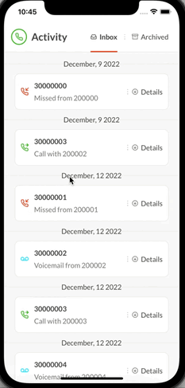

<h1 align="center">
    
</h1>

<h3 align="center">Frontend Assessment for Podopolo</h3>


<p align="center">
  
</p>

<p align="center">
 <a href="#information_source-how-to-use">How to use</a> • 
 <a href="#memo-license">License</a>
</p>

<br>
<br>

<p align="center">
  
</p>

<br>

# :information_source: How to use

https://docs.expo.dev/get-started/installation/


To run the app, you just need to have [Expo](https://reactnative.dev/docs/environment-setup) configured on your machine. If you already have yours set up, just follow the steps:

```bash
# Clone this repository
$ git clone https://github.com/saymon-araujo/podopolo-assessment

# Navigate to the repository folder
$ cd podopolo-assessment

# Install the dependencies
$ yarn install

# Run Expo Bundle
$ expo start

# Connect an device

```

<br>
<br>

# :memo: License

This project is under the MIT license. See the [LICENSE](https://github.com/saymon-araujo/podopolo-assessment/blob/main/LICENSE) for more information.

---

Made by Saymon Araújo, 👋 [Get in Touch!](https://www.linkedin.com/in/saymon-araujo/)
